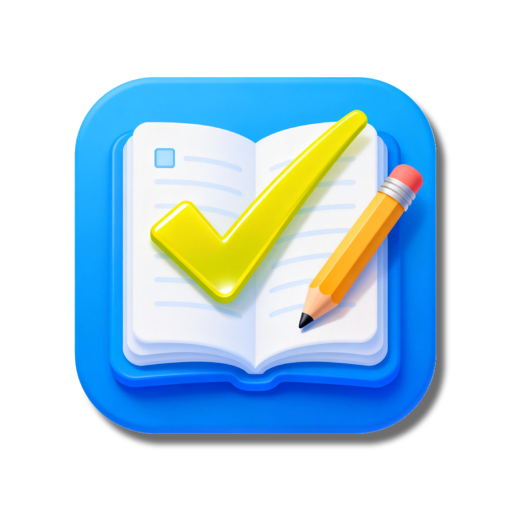

  
  <h1>课程打卡助手</h1>

一款轻量级的课程管理和学员打卡记录工具，帮助教师和培训机构轻松管理课程和学员的上课记录。

## 下载安装

当前应用正在 Google Play 封闭测试，需要先加入 Google 群组才能安装：

1. 加入测试群组：https://groups.google.com/g/ruiqianyi
2. 安装应用：https://play.google.com/store/apps/details?id=io.mybatis.classcheckin

## 功能特点

### 📚 课程管理
- 创建和管理多个课程
- 记录课程名称、学员列表、总课时数
- 实时显示已用课时和剩余课时
- 支持课程编辑和删除

### 📅 日历打卡
- 直观的月视图日历界面
- 点击日期快速记录打卡
- 支持多学员同时打卡
- 已打卡日期自动标记（绿色显示）
- 可为每次打卡添加备注

### 📊 统计分析
- 自动统计已用课时和剩余课时
- 按日期倒序显示打卡记录
- 查看每次打卡的详细信息
- 支持编辑和删除历史打卡记录

## 数据存储

所有数据均存储在设备本地的 SQLite 数据库中，不会上传到任何外部服务器。您的数据完全私密和安全。

## 隐私政策

我们非常重视您的隐私保护。本应用不收集、不上传任何个人数据，所有信息仅存储在您的设备本地。

- [隐私政策（中文）](./PRIVACY_POLICY.md)
- [Privacy Policy (English)](./PRIVACY_POLICY_EN.md)

## 系统要求

- **iOS**: 14+
- **Android**: 9+
- **Expo Go**: 最新版本

## 许可证

Apache License 2.0 - 详见 [LICENSE](./LICENSE) 文件
